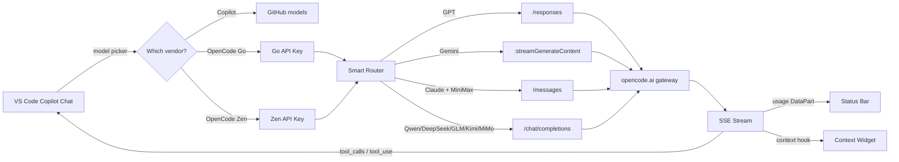

<div align="center">

# 🚀 OpenCode for GitHub Copilot Chat

### Use **30+ frontier AI models** (DeepSeek V4, Kimi K2.6, GLM-5.1, GPT-5.5, Claude Opus 4.7, Gemini 3.5, Grok…) in GitHub Copilot Chat — **free via BYOK**

**Bring Your Own Key (BYOK)** · OpenCode Zen (free) or Go (pay-per-use) · Works with native Copilot Agent Mode

[](https://marketplace.visualstudio.com/items?itemName=ltmoerdani.opencode-copilot-chat)
[](https://github.com/ltmoerdani/opencode-copilot-chat/releases)
[](./LICENSE)
[](https://code.visualstudio.com/)
[](./CONTRIBUTING.md)
[](https://github.com/ltmoerdani/opencode-copilot-chat)

[**✨ Why you'll love it**](#-why-youll-love-it) · [**⚡ Quick Start (60 sec)**](#-quick-start-60-sec) · [**🧠 Models**](#-models) · [**📊 Compare**](#-github-copilot-vs-this-extension) · [**🔧 Settings**](#-settings) · [**❓ FAQ**](#-faq) · [**💬 Community**](#-community)

</div>

---

> ### 💡 The elevator pitch
>
> **Copilot Chat is great — but its premium models cost $39/mo (Pro+), and the free tier is rate-limited.**
> This extension plugs **OpenCode's model gateway** into Copilot Chat's model picker. Use **OpenCode Zen** for **free** Claude Opus, GPT-5.5, Gemini, Grok, DeepSeek — or top up **OpenCode Go** (pay-per-use, no subscription) for premium models like DeepSeek V4 Pro, Kimi K2.6, GLM-5.1, Qwen3.7 Max, MiMo V2.5 Pro. You keep the native Copilot UI, tool-calling, and Agent Mode — you just get **way more models**, often **free or cheaper**.

---

## 🔥 Why you'll love it

| | What you get |
|---|---|
| 💸 **Cheaper than Copilot Pro+** | Copilot Free + OpenCode **Zen free** models = **$0** for Claude Opus, GPT-5.5, Gemini 3.5, Grok, DeepSeek. Need premium? OpenCode **Go** is pay-per-use (top-up), no $39/mo subscription |
| 🌍 **30+ frontier models** | DeepSeek V4, Kimi K2.6, GLM-5.1, Qwen3.7 Max, MiMo V2.5, MiniMax M2.7, Big Pickle, Nemotron — **all in one picker** |
| 🤖 **Full Agent Mode** | Tool-calling (read files, edit, run terminal) works natively — not just chat |
| 🧠 **Thinking controls** | Per-model reasoning effort (DeepSeek `max`, Qwen `thinking_budget`, MiniMax `on/off`, Mimo `low/med/high`) |
| 📊 **Live usage tracking** | Status bar shows Go subscription burn-rate across 5h / weekly / monthly tiers |
| 🔌 **Dual providers** | OpenCode **Go** (paid, pay-per-use) + OpenCode **Zen** (free) — run both at once, switch instantly |
| 🎯 **Smart routing** | Each model family auto-routes to its native transport (`/responses`, `/messages`, `streamGenerateContent`, `/chat/completions`) |
| 🖼️ **Vision + PDF + Audio** | Multimodal models pass through image, PDF, audio, and video inputs |
| 🔒 **Your key, your control** | API key stored in VS Code SecretStorage — never leaves your machine |

---

## ⚡ Quick Start (60 sec)

```text
1.  Install GitHub Copilot Chat (free) ──────────────────────────── ✓
2.  Install this extension ──────────────────────────────────────── ✓
3.  Get a free OpenCode Zen API key → opencode.ai ───────────────── ✓
4.  Open Copilot Chat → click model → "Add Models" → OpenCode Zen ── ✓
5.  Paste API key → pick a model → CHAT 🎉
```

<details>
<summary><b>📖 Detailed step-by-step with screenshots</b></summary>

1. **Install [GitHub Copilot Chat](https://marketplace.visualstudio.com/items?itemName=GitHub.copilot-chat)** — free, requires only a GitHub account.
2. **Install this extension** from the VS Code Marketplace (or press `F5` in this repo for dev mode).
3. **Get an API key:**
   - **Free:** Sign up at [opencode.ai](https://opencode.ai) → grab an **OpenCode Zen** key (free tier includes Claude, GPT, Gemini, Grok, DeepSeek).
   - **Paid (optional):** Top up for **OpenCode Go** to unlock DeepSeek V4 Pro, Kimi K2.6, GLM-5.1, Qwen3.7 Max, MiMo V2.5 Pro, MiniMax M2.7.
4. **Open Copilot Chat** (Cmd/Ctrl+Shift+I, or click the Copilot icon).
5. **Click the model picker** (current model name) → **Add Models…**
6. **Select** **OpenCode Go** or **OpenCode Zen**.
7. **Press Enter** to accept the default group name.
8. **Paste your API key** when prompted (stored securely in VS Code SecretStorage).
9. **Pick the models** you want enabled.
10. **Select any OpenCode model** from the picker and start chatting. 🚀

> **💡 Tips:**
> - Go and Zen are **separate provider groups** — both can be active simultaneously. Switch anytime from the picker.
> - If a model shows in **Language Models** view but not the chat picker, hover its row and click the **eye icon (👁)** to enable it.
> - Set `opencodego.freeOnly: false` to reveal **paid Zen models** in the picker.

</details>

---

## 🧠 Models

The extension fetches **live model lists** on every startup from:

| Provider | Endpoint | Cost |
|---|---|---|
| **OpenCode Go** | `https://opencode.ai/zen/go/v1/models` | Paid (top-up) |
| **OpenCode Zen** | `https://opencode.ai/zen/v1/models` | Free by default, paid optional |

### ⭐ OpenCode Go (paid — top-up)

| Model | Context | Max Output | Highlights |
|---|---:|---:|---|
| `deepseek-v4-pro` / `deepseek-v4-flash` | **1,000,000** | 384,000 | 🧠 Reasoning `off`→`max` |
| `qwen3.7-max` | **1,000,000** | 65,536 | 🧠 `thinking_budget` 4K–82K |
| `mimo-v2.5-pro` / `mimo-v2-pro` | **1,048,576** | 128,000 | 🧠 Effort `low`→`high` |
| `mimo-v2.5` | **1,000,000** | 128,000 | Fast & cheap |
| `kimi-k2.6` / `kimi-k2.5` | 262,144 | 65,536 | 🧠 `on`/`off` |
| `minimax-m2.7` / `minimax-m2.5` | 204,800 | 131,072 | 🧠 `on`/`off` |
| `glm-5.1` / `glm-5` | 202,752 | 32,768 | 🧠 `on`/`off` |

### 🆓 OpenCode Zen (free models — no payment needed)

| Model | Context | Max Output | Vendor |
|---|---:|---:|---|
| `claude-opus-4-7` / `claude-opus-4-6` | **1,000,000** | 128,000 | Anthropic |
| `claude-sonnet-4-6` / `claude-sonnet-4-5` | **1,000,000** | 64,000 | Anthropic |
| `gpt-5.5` / `gpt-5.5-pro` | **1,050,000** | 128,000 | OpenAI |
| `gpt-5.4` / `gpt-5.4-pro` / `gpt-5.4-mini` | 400,000–1,050,000 | 128,000 | OpenAI |
| `gemini-3.5-flash` / `gemini-3.1-pro` | **1,048,576** | 65,536 | Google |
| `grok-build-0.1` | 256,000 | 256,000 | xAI |
| `deepseek-v4-flash-free` | 200,000 | 128,000 | DeepSeek |
| `qwen3.6-plus-free` | 262,144 | 65,536 | Alibaba |
| `minimax-m2.5-free` | 204,800 | 131,072 | MiniMax |
| `nemotron-3-super-free` | 204,800 | 128,000 | NVIDIA |
| `big-pickle` | 200,000 | 128,000 | 🥒 Mystery box |

> Set `opencodego.freeOnly: false` to also reveal **paid Zen models** (Claude Opus paid tier, GPT-5.5 Pro, etc.)

<details>
<summary><b>🔬 How model metadata is resolved (3-tier fallback)</b></summary>

Limits and capabilities resolve in this priority order:

1. **Live metadata** from OpenCode `/models` endpoint
2. **6-hour models.dev snapshot** cached in VS Code `globalState`
3. **Bundled fallback catalog** shipped with the extension (works offline)

Deprecated/unavailable models are filtered before registration. Per-provider limits tracked separately (Go vs Zen) so shared models (e.g. `glm-5.1`, `qwen3.6-plus`) use correct values for each.

</details>

<details>
<summary><b>🛣️ Endpoint routing per model family</b></summary>

| Family | Endpoint | Why |
|---|---|---|
| Zen GPT (`gpt-*`) | `/responses` | OpenAI native |
| Zen Gemini (`gemini-*`) | `:streamGenerateContent?alt=sse` | Google native |
| Zen Claude (`claude-*`) + Go MiniMax (`minimax-m2.*`) | `/messages` | Anthropic-compatible |
| Everything else (Qwen, DeepSeek, GLM, Kimi, MiMo…) | `/chat/completions` | OpenAI-compatible |

All Qwen models use `/chat/completions` because they use OpenAI-native tool-calling format. Routing to Anthropic `/messages` broke tool calls.

</details>

---

## 📊 GitHub Copilot vs This Extension

GitHub Copilot has four tiers now — **Free**, **Pro ($10/mo)**, **Pro+ ($39/mo)**, and **Max ($100/mo)**. Here's how BYOK via OpenCode compares:

| | **Copilot Free** | **Copilot Pro $10/mo** | **Copilot Pro+ $39/mo** | **OpenCode for Copilot Chat** |
|---|---|---|---|---|
| 💰 **Cost** | $0 | $10/mo | $39/mo | **$0** with free Zen models · Go is pay-per-use (top-up) |
| 🤖 **Models** | GPT-5 mini, Haiku 4.5 (2,000 completions) | Pro catalog + Claude Code/Codex agents | Premium (Opus) | **30+ models**: DeepSeek V4, Kimi K2.6, GLM-5.1, Qwen3.7, MiMo V2.5, MiniMax M2.7, + free Claude/GPT/Gemini/Grok |
| 🧠 **Reasoning controls** | — | Per-model (GitHub decides) | Per-model (GitHub decides) | **Per-family thinking effort** you control (DeepSeek `max`, Qwen `thinking_budget`, etc.) |
| 🖼️ **Multimodal** | Limited | Yes (limited) | Yes (limited) | **Vision + PDF + Audio + Video** (per-model) |
| 🔧 **Agent Mode / tool-calling** | — | ✅ | ✅ | ✅ **Full** (read, edit, terminal) |
| 📊 **Usage transparency** | Opaque | Opaque | Audit logs | **Status bar burn-rate** + diagnostics report |
| 🔌 **Provider** | GitHub only | GitHub only | GitHub only | **Bring any OpenCode key** — Go (paid) or Zen (free), run both at once |
| 🎁 **Free Claude Opus / GPT-5.5?** | ❌ | ❌ | ❌ (paid tier only) | ✅ **Free** via Zen |
| 🚫 **Rate limit** | 2,000 completions/mo | Unlimited (rate-limited) | 4× Pro credits | Per OpenCode tier (Zen free has limits; Go top-up removes them) |

> **Not a replacement** — this extension *extends* Copilot Chat. You still need the (free) Copilot Chat extension + a GitHub account. BYOK models bypass the Copilot subscription billing entirely — you pay OpenCode directly (or nothing, on Zen free).

### 💡 When to use which?

- **Copilot Free + OpenCode Zen** → **$0 total**. Best for students, hobbyists, and trying frontier models.
- **Copilot Pro + OpenCode Go** → $10/mo for Copilot's polish + pay-per-use for DeepSeek Pro, Kimi K2.6, Qwen3.7 Max.
- **This extension alone** → Already works with just Copilot Free. Keep Copilot for autocomplete, use OpenCode models for chat/agent when you need variety or free tier.

---

## ✨ Features Deep Dive

### 🧠 Thinking & Reasoning Controls

Per-model reasoning configuration, dynamically enhanced with `reasoning_options` from `models.dev`:

| Family | Options | Setting |
|---|---|---|
| **DeepSeek** | `off` / `low` / `medium` / `high` / `max` | `opencodego.thinking.deepseek` |
| **GLM** | `on` / `off` | `opencodego.thinking.glm` |
| **Kimi** | `on` / `off` | `opencodego.thinking.kimi` |
| **MiniMax** | `off` / `on` | `opencodego.thinking.minimax` |
| **Mimo (Xiaomi)** | `off` / `low` / `medium` / `high` | `opencodego.thinking.mimo` |
| **Qwen** | `auto` / `on` / `off` + `thinking_budget` (4096–81920) | `opencodego.thinking.qwen` + `.qwenBudget` |
| **Any future reasoning model** | `off` / `on` (auto-detected from `models.dev`) | — |

> **`opencodego.debugReasoning`** — writes provider `reasoning_content` to **Output → OpenCode** for debugging.

### 📊 Usage Tracking

- **Go Usage Tracker** — real-time burn-rate of OpenCode Go subscription:
  - Tracks **5-hour rolling** ($12), **weekly** ($30), **monthly** ($60) tiers.
  - Client-side cost calc: token usage × per-model pricing (input/output/cache_read).
  - Status bar: `Go: 27%·62%·75%` — ⚠ warning when any tier exceeds 80%.
  - Persisted in VS Code `globalState` — survives restarts.
- **Response usage bar** — latest prompt/output/total/cache summary after each response.
- **Normalized usage DataPart** — emits `usage` MIME so Copilot Chat's context widget shows accurate token counts.

### 🛠️ Smart Routing & Reliability

- **Native endpoint routing** per family (see [Models](#-models) table)
- **Tool-calling** forwarded in correct format per endpoint (OpenAI `tool_calls` vs Anthropic `tool_use`)
- **Sticky gateway headers** (`x-opencode-session`, `x-opencode-request`, `x-opencode-client`) for affinity
- **Request & stream timeouts** — defaults 600s total / 120s idle; configurable
- **`ground` tag filtering** — `opencodego.stripThinkTags` (`auto` strips MiniMax only, `always`, `never`)

### 🔍 Diagnostics

| Command | What it does |
|---|---|
| `OpenCode Go: Diagnostics` | Markdown report of all Go models + recent request summaries |
| `OpenCode Zen: Diagnostics` | Same for Zen |
| `OpenCode: Model Picker Diagnostics` | All registered models (Go + Zen + Copilot) side-by-side |

---

## 🔧 Settings

| Setting | Default | Description |
|---|---|---|
| `opencodego.temperature` | `0.2` | Sampling temperature (`0`–`2`) |
| `opencodego.maxTokens` | `0` | Max output token override (`0` = per-model max) |
| `opencodego.maxInputTokens` | `0` | Context window override (`0` = per-model default) |
| `opencodego.debugReasoning` | `false` | Log `reasoning_content` to Output panel |
| `opencodego.requestTimeoutSeconds` | `600` | Total request timeout |
| `opencodego.streamIdleTimeoutSeconds` | `120` | Cancel if stream goes idle |
| `opencodego.showUsageStatusBar` | `true` | Show usage summary in status bar |
| `opencodego.freeOnly` | `true` | Zen: free models only. `false` = include paid |
| `opencodego.stripThinkTags` | `"auto"` | Strip `<think>` tags (`never`/`auto`/`always`) |
| `opencodego.thinking.deepseek` | `"off"` | `off`/`low`/`medium`/`high`/`max` |
| `opencodego.thinking.glm` | `"off"` | `on`/`off` |
| `opencodego.thinking.kimi` | `"off"` | `on`/`off` |
| `opencodego.thinking.minimax` | `"off"` | `off`/`on` |
| `opencodego.thinking.mimo` | `"off"` | `off`/`low`/`medium`/`high` |
| `opencodego.thinking.qwen` | `"off"` | `auto`/`on`/`off` |
| `opencodego.thinking.qwenBudget` | `"auto"` | `auto`/`4096`/`16384`/`32768`/`81920` |

<details>
<summary><b>📜 Full settings reference with descriptions</b></summary>

All settings live under the **OpenCode** namespace in VS Code Settings. Run **Preferences: Open Settings (UI)** and search `opencode`.

</details>

---

## 🎛️ Commands

The easiest way to manage your key is **Settings → Language Models** (gear ⚙). For advanced use, open the Command Palette (`Cmd/Ctrl+Shift+P`):

| Command | Description |
|---|---|
| `OpenCode Go: Manage Provider` | Manage legacy API key, refresh models, test connection |
| `OpenCode Go: Set API Key` | Store/update legacy OpenCode Go API key |
| `OpenCode Go: Diagnostics` | Report of Go models + request history |
| `OpenCode Zen: Diagnostics` | Report of Zen models + request history |
| `OpenCode: Model Picker Diagnostics` | All models (Go + Zen + Copilot) side-by-side |
| `OpenCode: Set Thinking Effort…` | Per-family thinking mode picker |
| `OpenCode Go: Show Usage Details` | Detailed Go subscription usage breakdown |

---

## ❓ FAQ

<details>
<summary><b>Do I need Copilot Pro, Pro+, or Max?</b></summary>

**No.** You only need the free [GitHub Copilot Chat extension](https://marketplace.visualstudio.com/items?itemName=GitHub.copilot-chat) and any GitHub account — even the **Copilot Free** tier works. BYOK models bypass Copilot's subscription billing entirely.

If you already pay for Copilot Pro ($10), Pro+ ($39), or Max ($100), you can still use this extension alongside it — keep Copilot for autocomplete, switch to OpenCode models in chat when you want variety, free tier, or specific models GitHub doesn't offer.

</details>

<details>
<summary><b>Is it really free? What's the catch?</b></summary>

**OpenCode Zen** offers **free models** including Claude Opus 4.7, GPT-5.5, Gemini 3.5, Grok, DeepSeek V4 Flash, Qwen3.6, MiniMax, and Big Pickle. Free-tier rate limits apply (set by OpenCode, not this extension).

**OpenCode Go** is **pay-per-use** (top-up your balance, no monthly subscription). It unlocks premium models like DeepSeek V4 Pro, Kimi K2.6, GLM-5.1, Qwen3.7 Max, MiMo V2.5 Pro, MiniMax M2.7. You only pay for what you use, and the status bar shows your burn-rate across 5-hour / weekly / monthly windows.

**This extension is free and open source** — you never pay us. You pay OpenCode directly (or nothing, on Zen free).

</details>

<details>
<summary><b>Does Agent Mode / tool-calling work?</b></summary>

**Yes — fully.** The extension forwards VS Code tool schemas in the correct format for each endpoint (OpenAI `tool_calls` or Anthropic `tool_use`). Copilot Agent can read files, search, edit, and run terminal commands through any OpenCode model.

</details>

<details>
<summary><b>Where is my API key stored?</b></summary>

In VS Code's **SecretStorage** — the same encrypted store used by GitHub auth. It never leaves your machine and is never sent anywhere except directly to `opencode.ai`.

</details>

<details>
<summary><b>Can I use Go and Zen at the same time?</b></summary>

**Yes.** They're separate provider groups. Add both via **Language Models → Add Models…**, enter each key separately, and switch between them from the chat model picker anytime.

</details>

<details>
<summary><b>A model shows in Language Models but not the chat picker — why?</b></summary>

Hover its row in the **Language Models** view and click the **eye icon (👁)** to toggle visibility.

</details>

<details>
<summary><b>Tool calls loop forever on Qwen — help?</b></summary>

Known issue with `qwen3.6-plus-free` on broad agent tasks (see [issue #1](./docs/issues/01-20260515-qwen36-tool-call-loop.md)). Workaround: set `opencodego.thinking.qwen: "off"` and use a narrower task scope, or switch to a paid Qwen model.

</details>

<details>
<summary><b>How do I report a bug or request a model?</b></summary>

[Open an issue](https://github.com/ltmoerdani/opencode-copilot-chat/issues/new/choose) — pick the Bug Report or Feature Request template. Include the diagnostics report (`OpenCode Go: Diagnostics` or `OpenCode Zen: Diagnostics`).

</details>

---

## 🏗️ Architecture



See [`docs/architecture/`](./docs/architecture/) for the full provider architecture, routing, and metadata resolution docs.

---

## 🤝 Contributing

Contributions welcome! Whether it's a typo fix, new model support, or a screenshot — every PR counts.

📋 See **[CONTRIBUTING.md](./CONTRIBUTING.md)** for guidelines.
💬 Discussions: [GitHub Discussions](https://github.com/ltmoerdani/opencode-copilot-chat/discussions)
🐞 Bugs: [Issue Tracker](https://github.com/ltmoerdani/opencode-copilot-chat/issues)

### Development

```bash
npm install      # install deps
npm run compile  # build TypeScript
npm run watch    # watch mode
npm run package  # build .vsix
```

Press `F5` in VS Code to launch an **Extension Development Host**.

---

## 📈 Roadmap

- [ ] 🎥 Demo GIF + screenshots
- [ ] 🌐 GitHub Pages landing page
- [ ] 📦 Publish to VS Code Marketplace
- [ ] 🏷️ Verified publisher badge
- [ ] 🔔 Webhook for new OpenCode models
- [ ] 🎨 Custom model aliases / favorites
- [ ] 📊 Usage charts webview panel
- [ ] 🌍 i18n (id, zh, ja)

> Have an idea? [Start a discussion](https://github.com/ltmoerdani/opencode-copilot-chat/discussions/new) or [open a feature request](https://github.com/ltmoerdani/opencode-copilot-chat/issues/new?labels=enhancement&template=feature_request.md).

---

## ⭐ Star History

<p align="center">
  <a href="https://github.com/ltmoerdani/opencode-copilot-chat">
    
  </a>
  &nbsp;👆 <b>Star this repo if it saved you money or unlocked a model you needed!</b>
</p>

<a href="https://star-history.com/#ltmoerdani/opencode-copilot-chat&Date">
 <picture>
   <source media="(prefers-color-scheme: dark)" srcset="https://api.star-history.com/svg?repos=ltmoerdani/opencode-copilot-chat&type=Date&theme=dark" />
   <source media="(prefers-color-scheme: light)" srcset="https://api.star-history.com/svg?repos=ltmoerdani/opencode-copilot-chat&type=Date" />
   
 </picture>
</a>

---

## 💬 Community

[](https://github.com/ltmoerdani/opencode-copilot-chat/discussions)
[](https://github.com/ltmoerdani/opencode-copilot-chat/issues)
[](https://twitter.com/intent/tweet?text=Using%2030%2B%20AI%20models%20in%20GitHub%20Copilot%20Chat%20for%20free%20with%20BYOK!&url=https://github.com/ltmoerdani/opencode-copilot-chat&hashtags=vscode,copilot,ai,byok,opencode)
[](https://www.reddit.com/submit?url=https://github.com/ltmoerdani/opencode-copilot-chat&title=OpenCode%20for%20Copilot%20Chat)

**If this saves you money or unlocks a model you needed — ⭐ star the repo and share it!**

---

## 📄 License

[MIT](./LICENSE) © 2026 [ltmoerdani](https://github.com/ltmoerdani)

OpenCode is a trademark of [opencode.ai](https://opencode.ai). This project is independent and not affiliated with GitHub, Microsoft, Anthropic, OpenAI, Google, or any model provider.

<div align="center">

**[⬆ Back to top](#-opencode-for-github-copilot-chat)**

</div>
